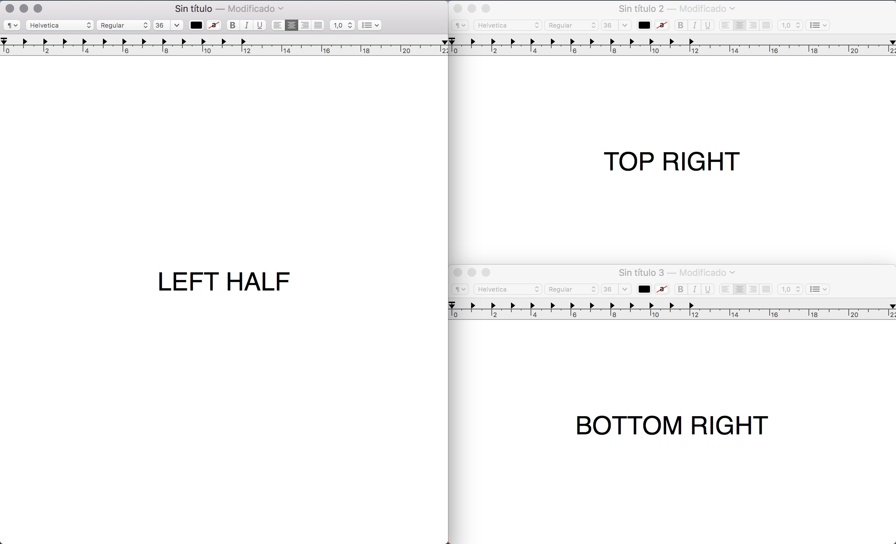
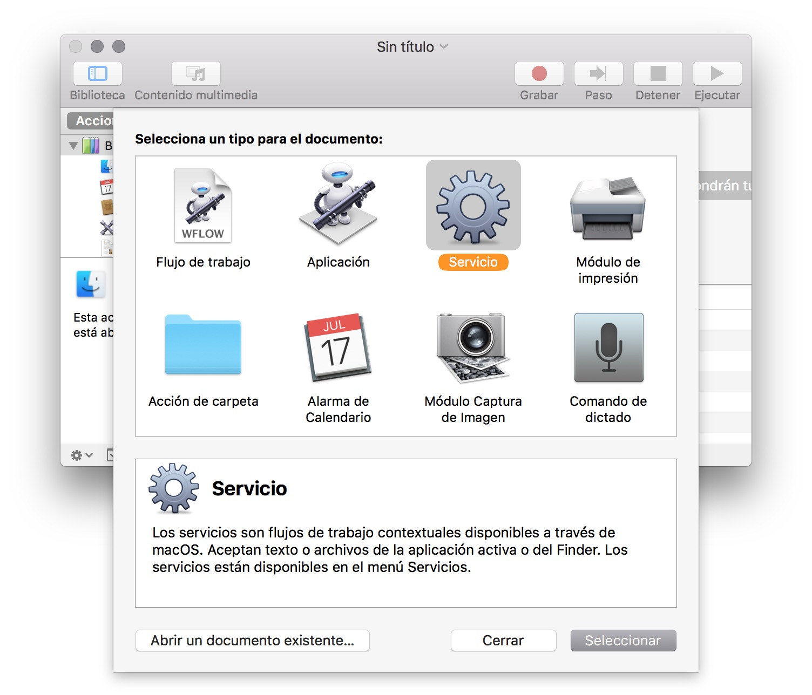
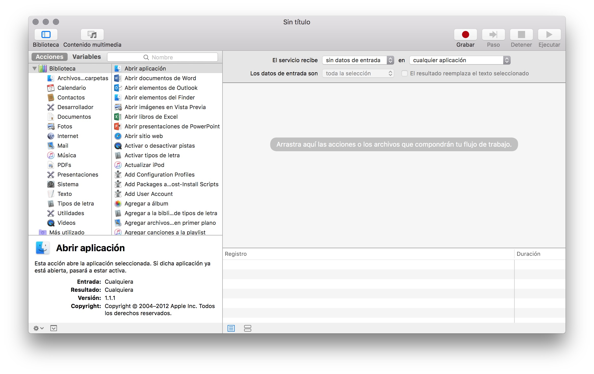
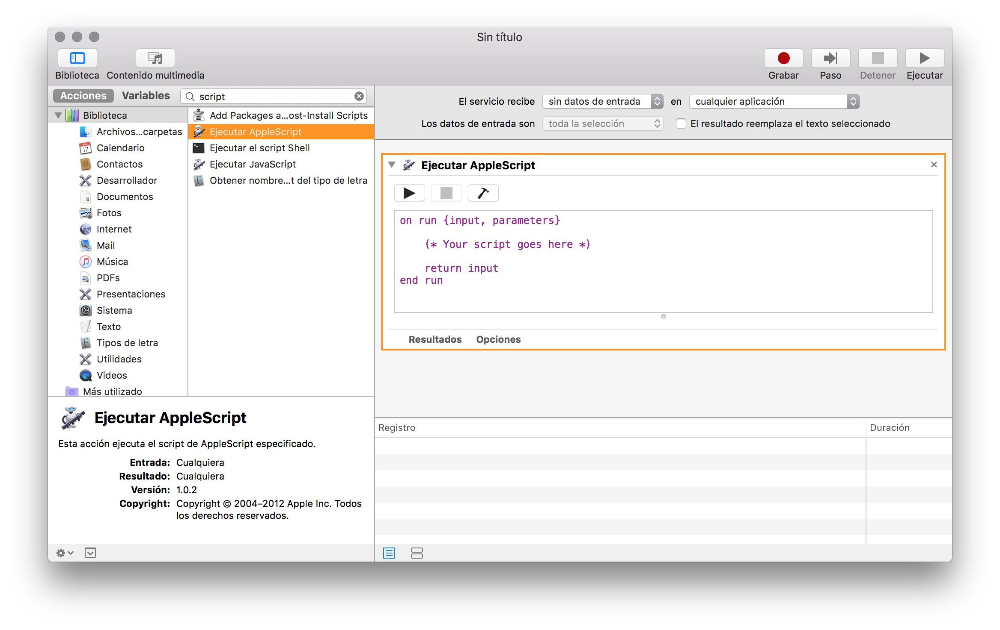
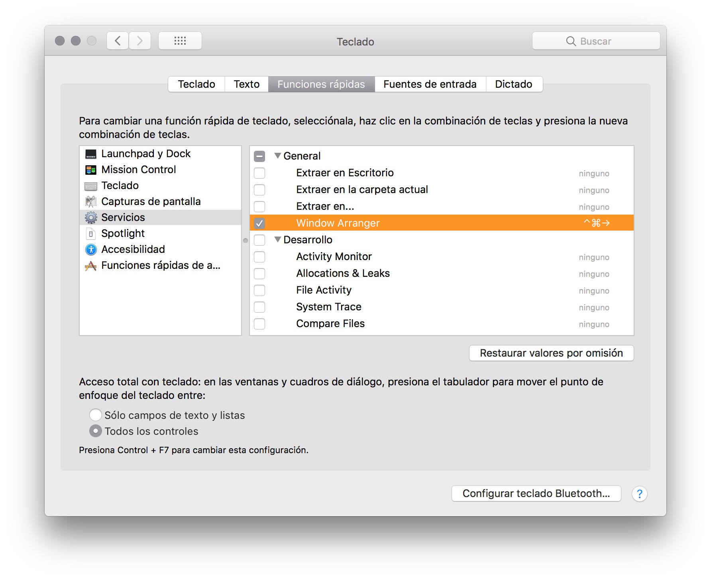

# WindowArranger
Script to arrange windows on MacOS

## What it does?
This is a script you can add to Mac OS automator to allow you to use a keyboard shortcut to align windows either as full-screen, top-right, top-left, bottom-right, bottom-left, left-half, and right-half. 

## How to install it?
1. Open Automator.app
2. Create New Service 

3. Set the input to Service Receives: No Input in Any Application

4. Search for "AppleScript" you should see Run AppleScript

5. Now Copy the script Paste in the Script
6. Save as Window Arranger (File -> Save As)
7. Now open up system preferences -> keyboard -> Keyboard Shortcuts -> Services
8. Select Window Arranger

9. Set the keyboard shortcut you want. For example: ⌥⌘← (Option + Command + Left Arrow)

## How it works? 
1. Gets the size of the screen and calculates dimensions of half-screen and quarter screen
2. See if the program has been run before and if it has checks a temporary file if it hasn't it creates a temporary file.
3. Cycles through the different size options for the active window.

## Caveats
I haven't tested it on multiple screens yet. 